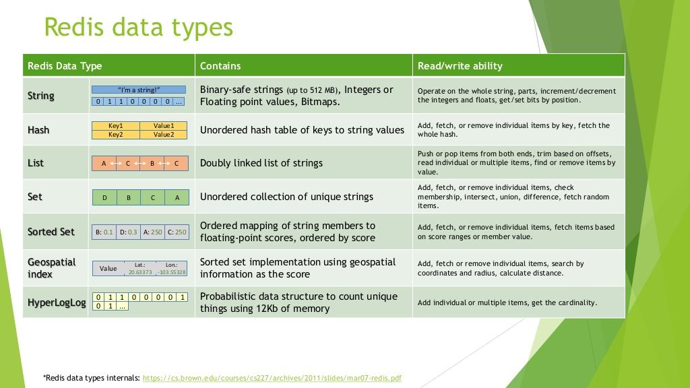
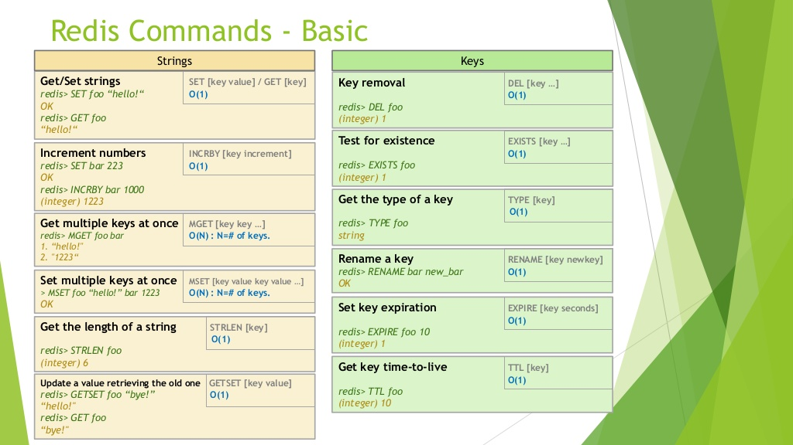
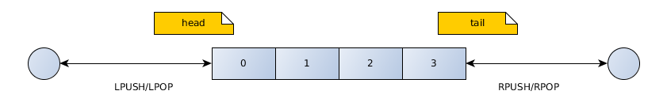
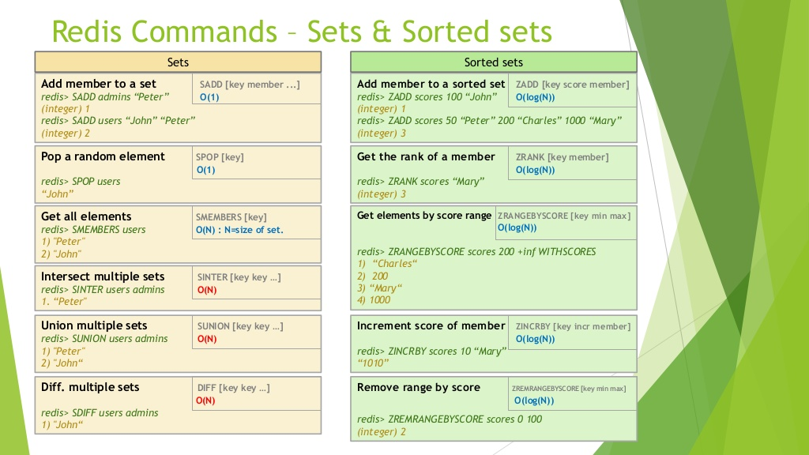
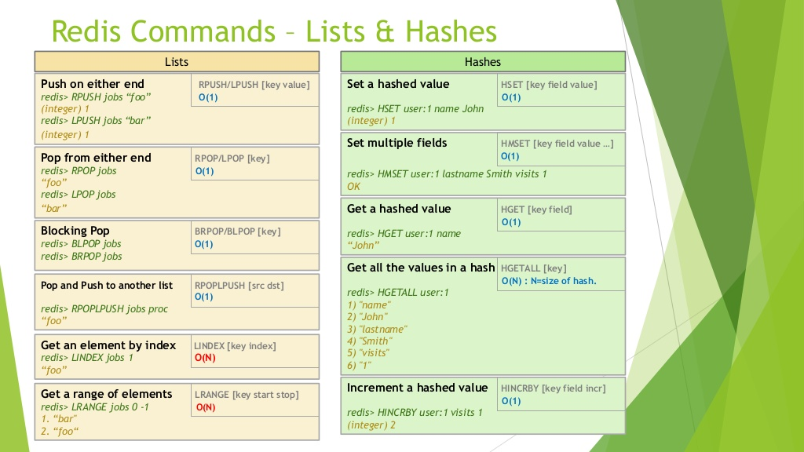

# REDIS
* <b>Redis</b> is an in-memory key-value store that can be used as a database, cache, and message broker. 
* <b>redis-cli</b> cmd-утилита для работы с redis (6379 порт по умолчанию).
* Ключи и значения в редис это строки с любым набором символов (а точнее просто байты).
* Общие команды:
```
KEYS '*' #вывести все ключи по маске
FLUSHALL #выбросить все ключи
TYPE key #вернуть тип объекта
DEBUG OBJECT key #вернуть служебную инфо об объекте (например метод его хранения)
```
### CRUD
* Создание и перезапись пары ключ-значение. (вернет ОК)
```
SET key value
```
* Получение ключа (вернет строку-значение ключа или nil)
```
GET key
```
* Удаление ключа
	* Возвращает: клоичество удаленных ключей
```
DEL key1 [key2...]
```
* Создать пару ключ-значение только если такого ключа еще нет в хранилище:(SET if Not eXists)
(вернет 1 если ключ создан, иначе 0)
```
SETNX key value
```
### Ключи с ограниченным временем жизни
* Установить время жизни ключа: (вернет 1 если значение установлено, иначе 0). Повторный вызов EXPIRE перепишет ттл в новое значение.
```
EXPIRE key seconds
```
* Посмотреть время жизни:
```
TTL key
#варианты ответов:
    The timeout left in seconds.
    -2 if the key doesn't exist (either it has not been created or it was deleted).
    -1 if the key exists but has no expiry set.
```
* Команды, удаляющие или перезаписывающие ключ удаляют ттл:
```
SET key1 val1
EXPIRE key1
SET key1 val2 #no expiration
```
* Команды, изменяющие содержимое объекта не влияют на ttl (RPUSH,RPOP etc).
### Data types

##### Строки - любой набор символов.

##### List

* Если ключ уже существует и не правильного типа, то команды возвращают ошибку.
* Связные списки, быстрое добавление элементов в начало и конец списка O(1). Получение по индексу медленное O(N) .
* Добавить элемент(ы) в хвост списка:(возвращает длинну списка)(создаст список, если его еще нет)
```
RPUSH key value [value2...]#key->value value2
```
* Добавить элемент(ы) в голову списка:(возвращает длинну списка)
```
LPUSH key value [value2...] #key->value2 value
```
* Получить подсписок [start end] (0 - первый элемент,-1 алиас для последнего элемента):
```
LRANGE key start end 
```
* Вернуть длинну списка:
```
LLEN key
```
* Удалить первый элемент (голова) списка и вернуть его:
```
LPOP key
```
* Удалить последний элемент (хвост) списка и вернуть его:
```
RPOP key
```
##### Set

* Неупорядоченный набор неповторяющихся элементов. It is possible to add, remove,unite and тест на присутствие эелемента in O(1).
* В основе реализации лежит hastable.
```
SADD key member [member ...] #добавить элементы в сет, вернет число добавленных элементов (создаст сет если он не создан)
#если ключ уже имеется и не типа сет->выдать ошибку
SREM key member [member ...] #удалить эл-ты из списка, вернет число удаленных эл-тов
SISMEMBER key member #есть ли элемент в сете? Вернет 0|1
SMEMBERS key #показать все элементы сета. Порядок элементов не определен и может меняться от вызова к вызову.
SUNION key [key ...] #объединить несколько сетов. Если ключ не существует, то значение считается пустым сетом.
```
##### Hash

* Хеш это именованный набор пар ключ-значение.
* Большие хеши хранятся как hashtable, чтобы обеспечить быстродействие O(1). Оптимизация по памяти исчезает.
* Создать или изменить хеш, идентифицируемый ключем key. Создать или переопределить в нем пару field=value. Возвращает:
  * 1 если field новое поле и было установлено значение
  * 0 если значение field было перезаписано
  * error если ключ адресует элемент не типа hash
```
HSET key field value
```
```
HGET key field #получить значение поля field из хеша key
HGETALL key #получить значения всех полей хеша key
HMSET key field value [field value ...] #установить значение нескольких полей хеша
HMGET key field [field ...] #получить значения указанных полей хеша
```
##### Sorted sets
* Сет, каждому элементу которого присвоено число с плав.точкой - score. В основе лежит skip list и hashtable.
* Добавление,удаление,обновление элементов (обновление score), получение диапазонов - быстрое O(log n).
* Элементы в сете сортированны по возрастанию score:
  * A>B если A.score>B.score
  * Если A.score=B.score, то A>B если строка A > строки B (A не может совпадать с B тк в сете не может быть 2х одинаковых элементов)
* Добавить  эелементы в сет с указанным score (или обновить score существующих элементов). Создать сет, если он не создан. Вернуть число добавленных элементов.
```
ZADD key score member [score member ...]
```
* Вернуть часть сортированного сета [start,stop]. [0,-1] вернуть весь сет. start,stop индексы элементов в сортированном сете, 0 - первый элемент.
```
ZRANGE key start stop [WITHSCORES]
```
* Получить элементы сета по диапазону scores:
```
ZRANGEBYSCORE key start_score end_score
```
* Удалить элемент(ы) (вернет число удаленных элементов):
```
ZREM key element1 [element2...]
```

##### Автоматическое создание и удаление ключей агрегированных типов
0. Если кшлюч существует и имеет несовместимый тип, то выдается ошибка.
```
SET user arboc #создаю ключ-строку
RPUSH user digambara -> ERROR #ключ типа строка а не список
```
1. Добавление элементов: если ключ не найден, то создается пустой и в него добавляются элементы.
2. Удаление элементов: если элементов не осталось, то удаляется и сам ключ.
3. Получение информации или удаление элементов: если ключ не найден, то предполагается наличие пустого ключа.
```
LLEN non_existent_key -> 0
```
### Выбор оптимального формата хранения данных
* Временная сложность алгоритма (в худшем случае)  - максимальное число элементарных операций, выполняемых алгоритмом для решения задачи на объеме данных N.
* Пространственная сложность алгоритма - объем памяти, требуемый для решения задачи на объеме данных N.
1. <b>ziplist</b> - это специальный формат данных агрегированного типа с низкой пространственной но высокой временной сложностью. Подходит для агрегатов малых размеров.
Используется для <b>list,sorted set, hash</b>, если они удовлетворяют следующим требованиям:
```
#/etc/redis.conf
#макс число_элементов 
<datatype>-max-ziplist-entries
#макс размер элемента [bytes]
<datatype>-max-ziplist-value
```
2. Set, у которого все эелементы - числа со знаком в десятичной системе счисления (64-бита) хранится в виде набора чисел, а не в виде хештаблицы - т.н. <b>IntSet</b>.
Требует намного меньше памяти.
```
#максимальное число элементов в intset
set-max-intset-entries 512
```
3. Пара ключ-значение требует 90 байт служебной информации для хранения => хранить малые строки не выгодно.
Малые хеши (значение_каждого_поля < 64,число_полей < 512) требуют мало памяти для хранения (хранятся в виде ziplist а не как хешмеп). 
Объект User, хранимый как хеш с нужными полями, занимает меньше места, чем тот же объект, хранимый как независимые пары ключ-значение:
```
userid:{name,lastName...}занимает меньше места, чем userId:name,userId:lastName
```
4. Для сохранения объекта выгоднее использовать list а не hash.
```
User{
	name: arboc
	lastname: digambara
} ->
User{0:arboc,1;digambara}

HMSET user:123 name arbocd lastname digambara
RPUSH user:123 arboc digambara
```
* Показать формат хранения объекта:
```
DEBUG OBJECT key
```
###  Транзакции
* Команды в redis можно складывать в очередь и позже выполнять или выбрасывать эту очередь команд. Эта очередь образует транзакцию.
* После вызова <b>MULTI</b> команды не выполняются а добавляются в очередь (QUEUED), <b>EXEC</b> отправляет очередь на выполнение, 
а <b>DISCARD</b> выбрасывает очередь.
```
MULTI
SET myCounter 1
#ответ будет QUEUED - добавлено в очередь
#псевдокод myCounter = myCounter+1
EXEC
```
* Свойства транзакций:
	1. Команды внутри транзакции выполняются последовательно. Транзакция выполняется монопольно (т.о. никакие другие команды (напр. от других клиентов)
    параллельно с транзакцией не выполняются).
    2. На выполнение отправляется либо вся группа команд, либо не одной.
* Ошибки внутри транзакций:
	1. Ошибки при добавлении команд в очередь (напр. синтаксические) приводят к отмене старта транзакции (при вызове EXEC будет ошибка).
	```
	MULTI
	SETT key value #ошибка синтаксиса
	EXEC #ошибка
	```
	2. Ошибки при выполнении команд (напр. работа с не верным типом данных ключа) НЕ приводят к отмене старта транзакции. Redis не поддерживает откат транзакций.
	Часть операций будет выполнена а чать нет.
	```
	SET user arboc
	RPUSH user arboc digambara
	EXEC
	#OK SET - успешно
	#ERROR RPUSH - ошибка
	#Ключ user будет типа String со значением arboc
	```
* <b>WATCH key1 [key2...]</b> - если значения ключей key1 [key2...] изменились после вызова WATCH и до вызова EXEC и вне текущей транзакции, 
то EXEC выдает ошибку и выполнение транзакции даже не начнется(wathc реализует т.н. optimistic lock):
```
#такой счетчик будет работать правильно даже если к myCounter осуществлялся доступ другим клиентом и вне транзакции
#при WATCH-ошибке попытаться выполнить команды заново
WATCH myCounter
val = GET myCounter
val = val+1
MULTI
SET myCounter val
EXEC
```
* <b>EXEC,DISCARD,UNWATCH</b> сбрасывают WATCH.
### Redisson
* Методы RList rc.getList("key"),RBucket rc.getBucket("key") не создают новый объект в redis при вызове только операций чтения у полученных RBucket,RList.
